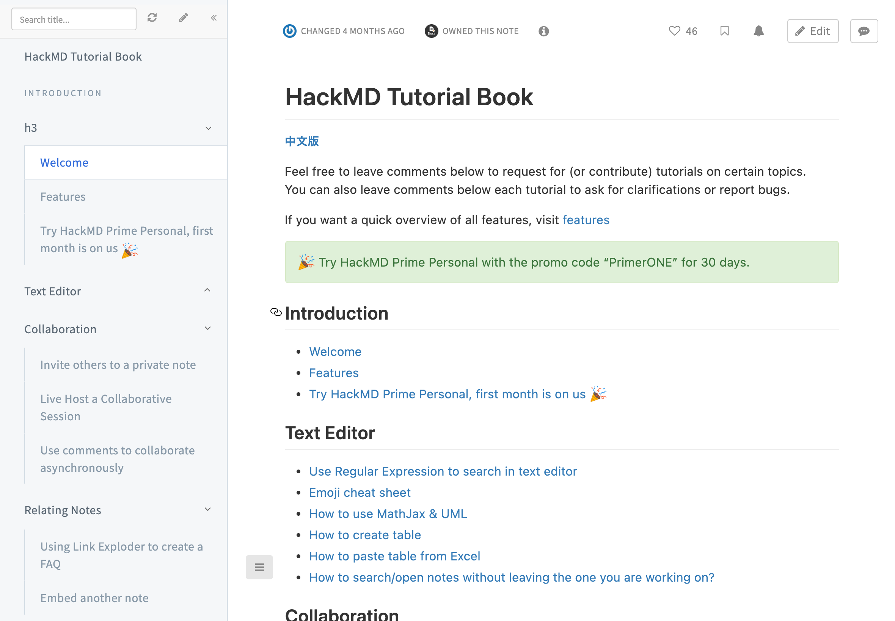

# HackMD Themes

## Available Themes

<!-- THEME_START -->

|       Theme        |               Preview               |             Syntax             |
| ------------------ | ----------------------------------- | ------------------------------ |
| GitBook Book Theme |  | `` |

<!-- THEME_END -->

## Getting Started with HackMD Themes Development

### Prerequisites

- [Register for a HackMD account](https://hackmd.io) and create an API token on [the settings page](https://hackmd.io/settings#api)
- [Create a test team](https://hackmd.io/c/tutorials/%2F%40docs%2Fwhat-is-team) for theme development, it can either be a private team or a public team.

### Setup

This project use [`pnpm`](https://pnpm.io/) as package manager. You can install it by:

```bash
npm install -g pnpm
```

Then install dependencies:

```bash
pnpm install
```

### Fill the credentials

Copy `.env.example` to `.env` and fill the credentials.

```bash
cp .env.example .env
```

Your `.env` file should look like this:

```bash
HACKMD_ACCESS_TOKEN=hackmd-access-token
HACKMD_WORKSPACE_TEAM_PATH=team-path
```

Where `hackmd-access-token` is the API token you created on [the settings page](https://hackmd.io/settings#api), and `team-path` is the path of the team you created for theme development. **Remember to change these values to your own**.

### Build

```bash
pnpm build
```

### Watch Themes and Build

```bash
pnpm dev
```

## How to create a new theme

1. Create a folder with the name of your theme in `src` directory, and create `style.scss` in it. For example, if your theme name is `my-theme`, you should create `src/my-theme/style.scss`.
2. Create a JSON file named `meta.json` in the same folder. The content of `meta.json` should be like this:

    ```json
    {
      "slug": "my-theme",
      "name": "My HackMD Theme"
    }
    ```

    - `slug` is the permalink of your Theme
    - `name` is the name of your theme

3. The folder structure might look like this:

   ```bash
   src
   └── my-theme
       ├── meta.json
       └── style.scss
   ```

4. Run `pnpm dev` to watch your theme and build it. The CLI will print out a table like this:

   ```bash
   ┌───────────────────────────┬──────────────┬───────────────────────────────────────────────┬───────────────────────────────────────┐
   │ title                     │ permalink    │ publishLink                                   │ syntax                                │
   ├───────────────────────────┼──────────────┼───────────────────────────────────────────────┼───────────────────────────────────────┤
   │ HackMD Theme - My Theme   │ gitbook-book │ https://hackmd.io/@test-team-dev/my-theme     │   │
   └───────────────────────────┴──────────────┴───────────────────────────────────────────────┴───────────────────────────────────────┘
   ```

   - Use the `syntax` to include your theme in HackMD notes and test it.
